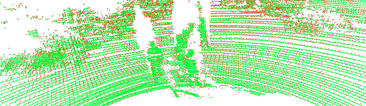
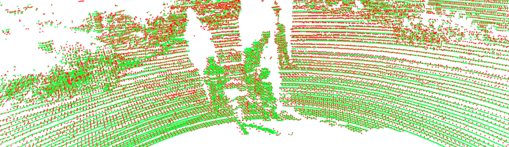

# R-PCC

**R-PCC: A Baseline for Range Image-based Point Cloud Compression**
 
This repository contains the python implementation for our full paper
submitted to ICRA 2022 "[R-PCC: A Baseline for Range Image-based Point Cloud Compression](https://arxiv.org/abs/2109.07717)".
If you find our paper or code useful, please cite:

```
@misc{wang2021rpcc,
      title={R-PCC: A Baseline for Range Image-based Point Cloud Compression}, 
      author={Sukai Wang and Jianhao Jiao and Peide Cai and Ming Liu},
      year={2021},
      eprint={2109.07717},
      archivePrefix={arXiv},
      primaryClass={cs.RO}
}
```


## Overview
- [Introduction](#introduction)
- [Installation](#installation)
- [Usage](#usage)

## Introduction
**The framework architecture of R-PCC:**

<div align="center">
  
</div>


**Qualitative results:**

<div align="center">


</div>


From left to right: Ours-uniform, Ours-Nonuniform, Draco, G-PCC, and JPEG-Range, respectively. The color in the point cloud and the colorbar are based on the mean symmetric chamfer distance between the reconstructed and original point cloud.


<div align="center">






</div>
First row, from left to right: Ours-Uniform, Ours-Uniform(birds-eye-view), Ours-Nonuniform;
Second row, from left to right: Draco, G-PCC, and JPEG-Range.

**Dataset:**

We evaluated our compression framework on three datasets: [KITTI (64E)](http://www.cvlibs.net/datasets/kitti/raw_data.php),
[Oxford (32E)](https://robotcar-dataset.robots.ox.ac.uk/), and HKUSTCampus (VLP16).

You can download and test from the dataset websites or directly download the tested point clouds in the paper from [here](https://hkustconnect-my.sharepoint.com/:f:/g/personal/swangcy_connect_ust_hk/Er6t4JRCHgZCrVcJAugJ21kBvsC1u2Fu7xmQaV_rUSQPBA?e=LIwBDA).
The detailed dataset file path can be found in ```data/*.txt```.

## Installation
*1. Clone the github repository.*
~~~shell
git clone --recursive https://github.com/StevenWang30/R-PCC.git
~~~

*2. Install CUDA and C++ extensions.* 

~~~shell
python setup.py develop
~~~
CUDA is used in FPS implementation and segmentation module, and some modules are implemented in C++ using pybind11.  


*3. Uninstall (if needed):* 
~~~shell
python setup.py develop --uninstall --user 
~~~
## Usage

### Config File
Set the parameters in the compression framework in ```cfg/compressor.yaml```.

 - **compress_framework: 'uniform'**
   
   Choose in ['uniform' or 'non-uniform']. Detailed explanation can be found in paper.

 - **accuracy: 0.02**

   The maximum reconstruction error, the most important parameter affecting the compression ratio and the reconstruction quality.
   
   For example, 0.02 means the maximum difference 
   between the reconstructed range image and the original range image is 0.02m.
   
 - **segment_method: 'FPS'**

   Choose in ['FPS' or 'DBSCAN']. Detailed explanation can be found in paper.

   DBSCAN is implemented by open3d and it is really slow.

 - **modeling_method: 'point'**
   
   Choose in ['point' or 'plane']. Detailed explanation can be found in paper.

   The speed of plane modeling is much slower than point modeling, because of the RANSAC fitting and ```np.where()``` in python.

 - **basic_compressor: 'bzip2'**
   
   The name of the basic compressor. Choose among ['lz4', 'bzip2', and 'deflate']. 
      - Compression rate: ```bzip2 > deflate >> lz4```
      - Compression speed:  ```lz4 : deflate : bzip2 = 300 : 100 : 1```

### Compress
Compress single frame point cloud:
~~~shell
python tools/compress.py --input assets/example_data/example.bin --output example.rpcc --lidar Velodyne64E --eval
~~~
Currently supported LiDAR types: [Velodyne64E](https://www.goetting-agv.com/dateien/downloads/63-9194_Rev-G_HDL-64E_S3_Spec%20Sheet_Web.pdf) / 
[Velodyne32E](https://gpsolution.oss-cn-beijing.aliyuncs.com/manual/LiDAR/MANUAL%2CUSERS%2CHDL32E.pdf) / 
[VelodyneVLP16](https://velodynelidar.com/wp-content/uploads/2019/12/63-9243-Rev-E-VLP-16-User-Manual.pdf)

Currently supported data type: ```.bin / .pcd / .ply / .npy / .npz / .txt ``` 


The uniform and non-uniform compression framework can be switched by adding ```--nonuniform```, and most of the parameters in the 
```compressor.yaml``` can be manually set in the command line. But it is strongly recommanded to set the parameters in the ```yaml``` file to 
make sure they are matching while compression and decompression.

### Decompress
~~~shell
python tools/decompress.py --input example.rpcc --output reconstructed.pcd --lidar Velodyne64E
~~~

Add original point cloud file to evaluate the reconstruction quality.
~~~shell
python tools/decompress.py --input example.rpcc --output reconstructed.pcd --lidar Velodyne64E --eval --original_point_cloud assets/example_data/example.bin
~~~

### Compress datalist
Use datalist.txt to compress batch of point cloud.

~~~shell
python tools/compress_datalist.py --datalist data/test_64E_KITTI_city.txt --output_dir /output/R-PCC/test/compressed --lidar Velodyne64E 
~~~

The output compressed bitstream will be saved in ```--output_dir + original_file_path``` with suffix ```'.rpcc'```.

Add ```--output``` to show the compression time and results on screen.

Add ```--workers 4``` to set number of workers for parallel compression.

Example datalist files are in ```data```.


### Decompress datalist
~~~shell
python tools/decompress_datalist.py --datalist decompress_datalist.txt --output_dir /data/R-PCC/test/decompressed --lidar Velodyne64E --workers 4
~~~

The file path in the datalist must have ```.rpcc``` suffix.

The output reconstructed point clouds are ```.bin``` files. The intensity information will be dropped and replaced  with all-zeros.


### Acknowledgement

Part of ```"FPS"``` related code is borrowed from [OpenPCDet](https://github.com/open-mmlab/OpenPCDet).